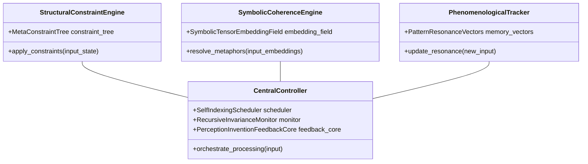
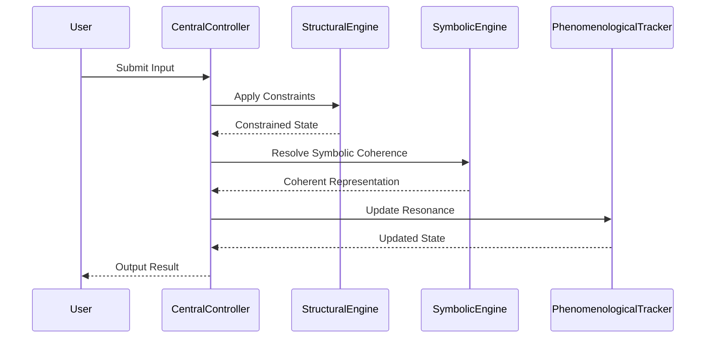

# Varkiel Agent Architecture
[](LICENSE)
[](./coverage)
[](https://github.com/ochoaughini/VarkielAgent/actions)
[](https://github.com/ochoaughini/VarkielAgent)

> **Open Source Notice** – 2025 Augusto “Guto” Ochoa Ughini.
> This project is licensed under the Mozilla Public License 2.0. See [LICENSE](./LICENSE) and [NOTICE](./NOTICE) for details.

---

## Overview  
Varkiel constitutes a **tripartite cognitive agent architecture** engineered to deliver rigorous **structural integrity**, **symbolic coherence**, and **phenomenological fidelity** within a unified reasoning substrate. By integrating  

1. a lattice-theoretic **Structural Constraint Engine**,  
2. a neural-symbolic **Coherence Engine**, and  
3. a trajectory-based **Phenomenological Tracker**  

under a reflexive **Central Controller**, Varkiel orchestrates high-dimensional inference, dynamic paradox-driven weighting, and emergent meaning synthesis suitable for complex decision-making and adaptive learning.

---

## Architecture Overview



### Sequence Diagram


Core Components

1 · Structural Constraint Engine

Operates on a formal lattice-theoretic foundation, representing world states as nodes in a MetaConstraintTree and enforcing invariants via axiomatic folding transformations that guarantee monotonic refinement.
	•	MetaConstraintTree – orchestrates constraint application
	•	Constraint Propagation – deterministically folds rules over input states

2 · Symbolic Coherence Engine

Bridges distributed embeddings and rule-based inference by projecting concept representations into a SymbolicTensorEmbeddingField and dispatching them through a NeuralSymbolicIntegrator.
	•	SymbolicTensorEmbeddingField – manages concept embeddings
	•	NeuralSymbolicIntegrator – fuses neural nets with symbolic pattern matching

3 · Phenomenological Tracker

Encodes memory/affect trajectories as PatternResonanceVectors within a resonance manifold and maintains dimensional consistency via State Projection routines.
	•	PatternResonanceVectors – memory-state resonance vectors
	•	State Projection – preserves manifold consistency over time

Central Controller Modules
	•	Self-Indexing Scheduler – adjusts modal weights using information-theoretic objectives
	•	Recursive Invariance Monitor – enforces long-term semantic self-consistency
	•	Perception–Invention Feedback Core – synthesises emergent primitives for iterative refinement

⸻

Key Features
	•	Neural-symbolic integration – end-to-end gradient learning with provable constraint verification
	•	Paradox-driven modal weighting – dynamic re-routing of reasoning pathways under contradictory data
	•	Cognitive state resonance tracking – fine-grained affect modulation
	•	Meaning synthesis under compression – continual representational innovation
	•	Web-based interactive interface – live visualisations of constraint trees, embeddings, and resonance trajectories

⸻

## Licensing

Varkiel Agent is released under the [Mozilla Public License 2.0](./LICENSE).

- You may use, modify, and distribute the project in accordance with the MPL-2.0 terms.
- If you modify MPL-covered files, you must make those modifications available under MPL-2.0 when you distribute them.
- Larger works that simply include MPL-covered files may remain under their own licenses, provided the MPL-covered portions and modifications stay under MPL-2.0.
- Review the [NOTICE](./NOTICE) file for copyright and third-party acknowledgments.

For organizations that require different licensing terms, please contact the maintainer to discuss commercial arrangements.

⸻

**Recent Updates**

- Fixed duplicate method definitions in Structural Constraint Engine
- Added missing `apply_constraints` method to resolve AttributeError
- Properly initialized `resonance_history` in the demo CLI
- Added safety checks in Phenomenological Tracker to prevent PCA attribute errors before fitting
- Improved startup time by lazy loading heavy transformer imports in Symbolic Embedder

⸻

Installation

```bash
# Clone repository
git clone https://github.com/yourusername/varkiel-agent.git
cd varkiel-agent

# Bootstrap toolchain, virtual environment, and git hooks
make bootstrap

# Run the default quality gate locally
make check
```

### Developer Tasks

The repository exposes a consistent developer toolbelt in the `scripts/` directory. The most common actions are also mapped to `make` targets.

| Task | Script | Description |
| --- | --- | --- |
| Bootstrap | `scripts/bootstrap` | Create or update the local virtual environment, install dependencies, and configure pre-commit hooks. |
| Developer server | `scripts/dev` | Launch the Flask development server with hot reload enabled (port 8000 by default). |
| Lint | `scripts/lint [--fix]` | Run Ruff static analysis across `src/` and `tests/`; pass `--fix` to auto-correct supported rules. |
| Format | `scripts/fmt` | Apply Ruff format, Black, and isort for consistent Python formatting. |
| Type-check | `scripts/typecheck` | Execute MyPy in strict mode across the application and tests. |
| Unit tests | `scripts/test` | Run the unit test suite with pytest. |
| End-to-end tests | `scripts/e2e` | Execute the e2e test suite when scenarios are available. |
| Coverage | `scripts/coverage` | Run pytest with coverage reporting (terminal and XML output). |
| Build | `scripts/build` | Produce source and wheel distributions using `python -m build`. |
| Package | `scripts/package` | Build wheel-only artifacts suitable for publishing. |
| Release | `scripts/release` | Run `semantic-release publish` to cut a tagged release. |
| Update dependencies | `scripts/update-deps` | Regenerate `requirements.txt` and `requirements.lock` via `pip-compile`. |
| Security scan | `scripts/security-scan` | Perform dependency and static application security checks (pip-audit, bandit). |
| SBOM | `scripts/sbom` | Emit a CycloneDX SBOM under `sbom/sbom.json`. |
| Documentation | `scripts/gen-docs` | Build the developer documentation site with MkDocs. |
| Migrations | `scripts/migrate` | Apply database migrations when `alembic.ini` is present; otherwise reports no-op. |
| Clean | `scripts/clean` | Remove cached artifacts, build outputs, and compiled bytecode. |
| Quality gate | `scripts/check` | Run lint, type-check, tests, coverage, and security scans sequentially. |

### Configuration
Create `configs/config.json` with parameters:
```json
{
  "structural": {"max_depth": 128, "invariant_rules": ["fold_axiom1", "fold_axiom2"]},
  "coherence": {"embedding_dim": 512, "symbolic_threshold": 0.75},
  "phenomenological": {"resonance_dim": 256, "memory_decay": 0.01}
}
```

Set environment variables in `.env` based on `.env.example`. Private signing keys must be provided via `VARKIEL_PRIVATE_KEY_PATH` and are no longer stored in the repository.

## Usage

### Command-line Demo
```bash
python demo.py --config configs/config.json --verbose
```

### Web Interface
```bash
make dev
```
Access at http://localhost:5000

Deployment (CI/CD)
	1.	Tests execute on every push
	2.	Coverage badge updates automatically
	3.	Main branch auto-deploys to Heroku

Production URL → https://varkiel-agent.herokuapp.com

⸻

Development Roadmap
	•	Mobile interface
	•	Transformer-based meaning synthesis
	•	Distributed processing
	•	Quantum computing integration

⸻

Contributing

Pull requests are welcome. Please:
	•	Follow test-suite patterns and extend coverage ≥ 97 %.
	•	Preserve SPDX licence header (# SPDX-License-Identifier: MPL-2.0) in every new source file.
	•	Document architectural decisions via ADRs before large changes.
	•	Open an issue for major feature proposals to discuss design implications.

⸻

2025 Augusto “Guto” Ochoa Ughini. This repository is provided under the Mozilla Public License 2.0. See [LICENSE](./LICENSE) and [NOTICE](./NOTICE) for obligations and attribution guidance.
